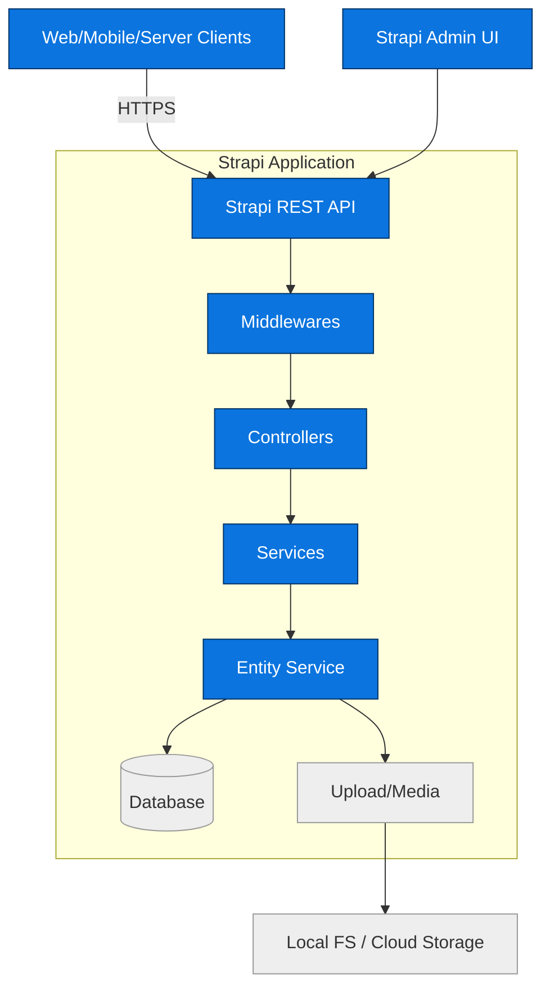
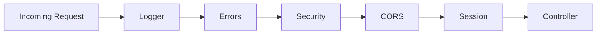
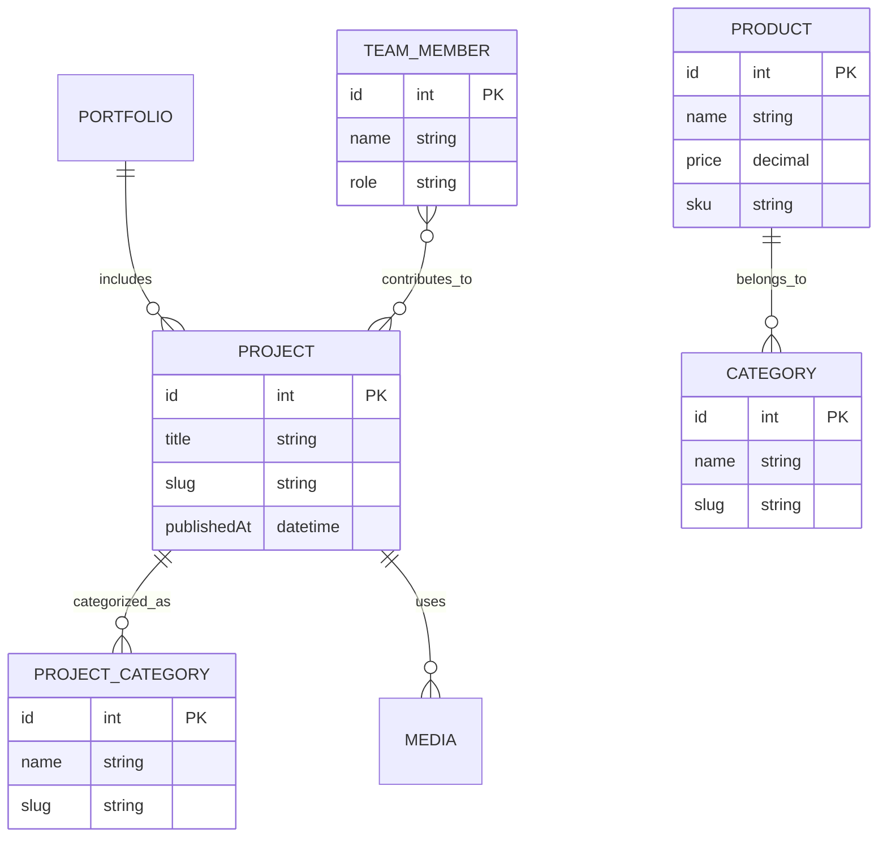
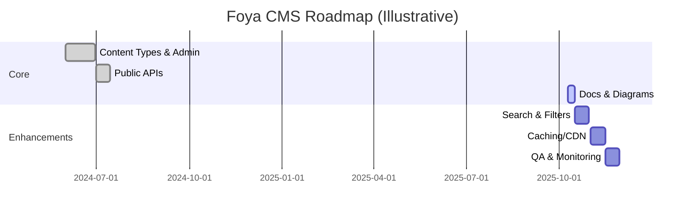

# 🚀 Getting started with Strapi

## Foya Development — Comprehensive Repository Guide

This document provides an in-depth overview of the project from three lenses: software architecture, software development, and product management. It synthesizes the codebase structure, data model, runtime configuration, and roadmap into a single reference with diagrams.

### What this repo is

- Headless CMS built on Strapi 5.x with TypeScript
- Hosts APIs and content types for company site: projects, products, portfolio, team, homepage, etc.
- Includes admin panel configuration and plugin setup

---

## System Architecture



### Request lifecycle

1. Request enters Strapi middleware stack (`config/middlewares.ts`)
2. Routed to content-type controller (e.g. `src/api/project/controllers/project.ts`)
3. Controller delegates to service for business logic
4. Service uses Strapi entity service to read/write DB
5. Response serialized according to API config (`config/api.ts`)

### Security flow



Key middleware (enabled by default): `logger`, `errors`, `security`, `cors`, `query`, `body`, `session`, `favicon`, `public`.

---

## Runtime Configuration

- `config/server.ts`: host/port, `APP_KEYS`
- `config/database.ts`: supports `sqlite`, `mysql`, `postgres` via env; connection pooling and optional SSL
- `config/api.ts`: REST defaults (limit, maxLimit, withCount)
- `config/admin.ts`: admin auth secrets and feature flags
- `config/plugins.ts`: plugin configuration (extensible)

Environment variables (examples):

```bash
HOST=0.0.0.0
PORT=1337
APP_KEYS=key1,key2,key3,key4

DATABASE_CLIENT=sqlite
DATABASE_FILENAME=.tmp/data.db

ADMIN_JWT_SECRET=...
API_TOKEN_SALT=...
TRANSFER_TOKEN_SALT=...
ENCRYPTION_KEY=...
```

---

## Codebase Structure

```text
config/           # Application, database, admin, middleware, plugins
src/
  api/            # Feature modules (content types, controllers, routes, services)
  components/     # Reusable Strapi components (JSON schemas)
  extensions/     # Plugin extensions (e.g., documentation)
  index.ts        # Strapi register/bootstrap hooks
types/generated/  # Auto-generated TS types
public/           # Static assets
scripts/          # Utilities (e.g., seed)
```

Strapi hooks entrypoint (`src/index.ts`) exposes `register` and `bootstrap` for custom init logic.

---

## Domain Model Overview

This project defines multiple content types: availability, category, company, contact, contact-detail, global, home-hero, homepage, job-opening, portfolio, portfolio-hero, press-item, privacy-policy, product, project, project-category, team-member. Components under `src/components/shared` are reused across these types (e.g., `seo`, `hero`, `gallery`).

### Entity-Relationship (high-level)



Components example (from `src/components/shared`): `seo`, `hero`, `gallery`, `press`, `team`, `rich-text`, etc., enabling structured sections across pages like `homepage` and `portfolio`.

---

## API Surface

Every content type follows Strapi REST conventions and exposes:

```http
GET    /api/<collection>           # list with pagination, filters, sorting
GET    /api/<collection>/:id       # single by id
POST   /api/<collection>           # create (auth required)
PUT    /api/<collection>/:id       # update (auth required)
DELETE /api/<collection>/:id       # delete (auth required)
```

Common query params:

- `populate` to include relations/components
- `filters[...]` to filter by fields/relations
- `sort` to sort
- `pagination[page]`, `pagination[pageSize]`
- `locale` for i18n-aware types

Example:

```http
GET /api/projects?populate=cover,project_category&filters[project_category][slug][$eq]=residential&pagination[page]=1&pagination[pageSize]=24
```

Performance note: boolean flag filters on projects were optimized to resolve aliases to relation IDs once and filter by IDs to avoid large OR queries (see `src/api/project/controllers/project.ts`).

---

## Build, Run, and Deploy

Scripts (`package.json`):

- `dev` / `develop`: start Strapi in watch mode
- `build`: build admin
- `start`: start server
- `start:prod`: build then start
- `seed:example`: seed demo data

Local development:

```bash
npm install
npm run develop
# Admin at http://localhost:1337/admin
```

Database configuration supports SQLite (default), MySQL, and Postgres. Use env vars to switch clients.

---

## Product Perspective

### Value proposition

- Single backend for company content and portfolio
- Flexible schema with reusable components for rich pages
- Headless APIs usable by multiple frontends

### Roadmap (illustrative)



### KPI examples

- API p95 latency < 200 ms
- 99.9% uptime
- Admin content throughput +30%

---

## Conventions and Quality

- TypeScript-first; generated types live in `types/generated`
- Keep files under 500 LOC; modularize by feature
- Immutable, functional style; early returns; descriptive names
- Use environment variables for secrets and DB config
- Add business logic in services and custom controllers, not in routes

---

## Extending the System

Potential next steps:

- Add caching (Redis) for heavy list endpoints
- Move media to S3-compatible storage and use a CDN
- Introduce e2e and integration tests
- Add GraphQL plugin if needed for complex aggregations

---

## References

- `PLANNING.md`: deeper architectural analysis with more diagrams
- `TASK.md`: task log and changes

Strapi comes with a full featured [Command Line Interface](https://docs.strapi.io/dev-docs/cli) (CLI) which lets you scaffold and manage your project in seconds.

### `develop`

Start your Strapi application with autoReload enabled. [Learn more](https://docs.strapi.io/dev-docs/cli#strapi-develop)

```
npm run develop
# or
yarn develop
```

### `start`

Start your Strapi application with autoReload disabled. [Learn more](https://docs.strapi.io/dev-docs/cli#strapi-start)

```
npm run start
# or
yarn start
```

### `build`

Build your admin panel. [Learn more](https://docs.strapi.io/dev-docs/cli#strapi-build)

```
npm run build
# or
yarn build
```

## ⚙️ Deployment

Strapi gives you many possible deployment options for your project including [Strapi Cloud](https://cloud.strapi.io). Browse the [deployment section of the documentation](https://docs.strapi.io/dev-docs/deployment) to find the best solution for your use case.

```
yarn strapi deploy
```

## 📚 Learn more

- [Resource center](https://strapi.io/resource-center) - Strapi resource center.
- [Strapi documentation](https://docs.strapi.io) - Official Strapi documentation.
- [Strapi tutorials](https://strapi.io/tutorials) - List of tutorials made by the core team and the community.
- [Strapi blog](https://strapi.io/blog) - Official Strapi blog containing articles made by the Strapi team and the community.
- [Changelog](https://strapi.io/changelog) - Find out about the Strapi product updates, new features and general improvements.

Feel free to check out the [Strapi GitHub repository](https://github.com/strapi/strapi). Your feedback and contributions are welcome!

## ✨ Community

- [Discord](https://discord.strapi.io) - Come chat with the Strapi community including the core team.
- [Forum](https://forum.strapi.io/) - Place to discuss, ask questions and find answers, show your Strapi project and get feedback or just talk with other Community members.
- [Awesome Strapi](https://github.com/strapi/awesome-strapi) - A curated list of awesome things related to Strapi.

---

<sub>🤫 Psst! [Strapi is hiring](https://strapi.io/careers).</sub>
